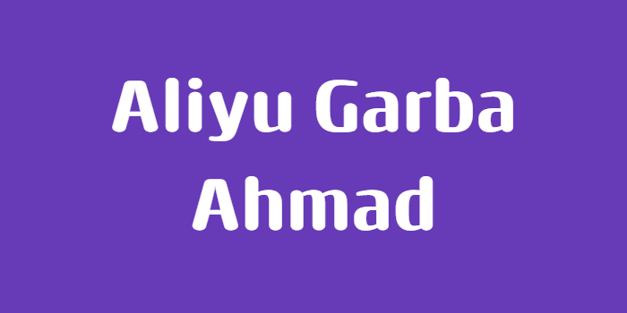

 # Aliyu Garba Ahmad — Software Engineering Portfolio
Welcome! This is the home of every project I build during the UpliftHub Bootcamp and
beyond.
## About Me
I'm based in Bauchi and learning software engineering through the UpliftHub Bootcamp. My

# - **Track:** Backend (Laravel). see [track-decision.md](./track-decision.md)

## Bootcamp Projects
| Week | Project | Description |
|------|---------|-------------|
| 6 | BauchiUtils | A 15-function utility library |
| 7 | Student Records | An in-memory CRUD database |
| 8 | This portfolio | Set up and configured this repo |
| 9 | System-diagnostics | A node CLI that reports system info, with proper stdout/stderr separation |
## How to Reach Me
- GitHub: [@Aliyu-G-Ahmad](https://github.com/Aliyu-G-Ahmad)
- Email: aliyugahmad015@gmail.com
